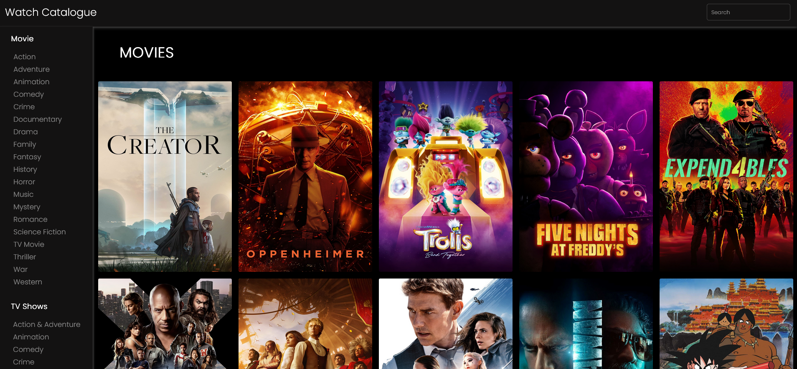

# Watch Catalogue Webpage



## Overview

The **Watch Catalogue Webpage** is the same generic API movie catalogue project that many other beginner devs create. Understanding api usage, layout design, and general js was the main result from all of this.

Why did I remake the repository? 
- Revamped the project by moving the API key from being hardcoded in the frontend to running on a Node.js server.

Was I being stupid keeping a personal api key open?
- Yes.

## Key Features

- **Comprehensive Media Browsing**: Browse both movies and TV shows in a unified interface
- **Advanced Search**: Find specific movies or TV shows with real-time search functionality
- **Genre Filtering**: Filter content by genres for more focused browsing
- **Responsive Design**: Optimized viewing experience across all device sizes
- **Dynamic Content Loading**: Real-time content updates without page refreshes

## Technologies Used

- **HTML5**: Semantic markup for structured content
- **CSS3**: Modern styling with responsive design principles
- **JavaScript**: Dynamic content handling and API integration
- **TMDB API**: Rich media data source
- **ChatGPT + Claude**: Assisted with code analysis and template generation

## Technical Architecture

### API Integration

The application integrates with TMDB API using the following key endpoints:

- Popular movies and TV shows retrieval
- Search functionality across media types
- Genre listing and filtering
- Media details fetching

### Core Functions

#### Content Display
```javascript
getMovies(url)       // Fetches and displays popular movies
getTVshows(url)      // Fetches and displays popular TV shows
showMovies(movies)   // Renders movie cards
showTVshows(tvShows) // Renders TV show cards
```

#### Search Implementation
```javascript
searchMedia(searchTerm, mediaType)    // Handles media search
showCombinedResults(results)          // Displays combined search results
```

#### UI Components
```javascript
addGenreClickListener(genreList, mediaType, getMediaFunction)  // Genre filtering
handleNavButtonClick()                                         // Responsive navigation
```

## Code Organization

The project follows a clear separation of concerns:

### HTML Structure
- Navigation components
- Search interface
- Content containers
- Media cards
- Genre filters

### CSS Architecture
- Responsive design rules
- Color schemes
- Typography
- Animation definitions
- Component styling

### JavaScript Modules
- API interaction layer
- Content rendering engine
- Event handling
- Search functionality
- Navigation management

## Known Issues

1. **Mobile Landscape Mode**
   - Description: Content overflow issues in landscape orientation
   - Status: Under investigation
   - Workaround: Use portrait mode for optimal experience

2. **Catalogue Selection Styling**
   - Description: Visual inconsistency in catalogue item selection
   - Impact: Multiple items may appear selected
   - Status: Fix in progress

## Possible Future Enhancements (Probably never lol)
   - Integrate additional media sources
   - Enhance search filters


